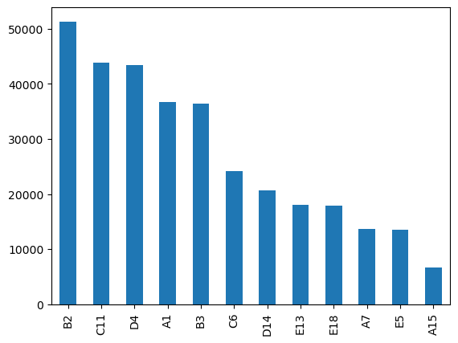
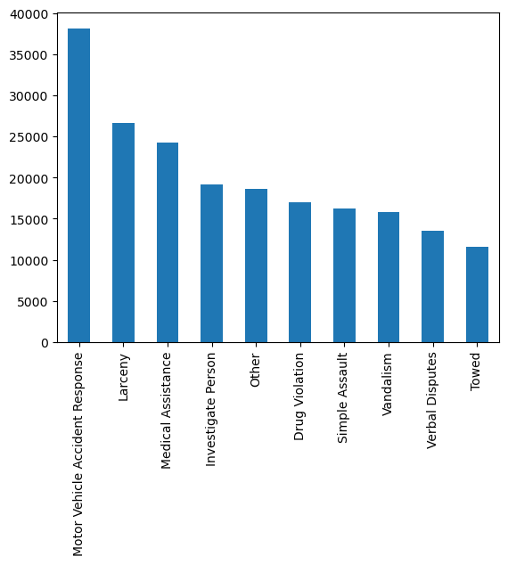
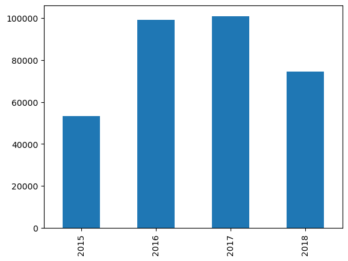
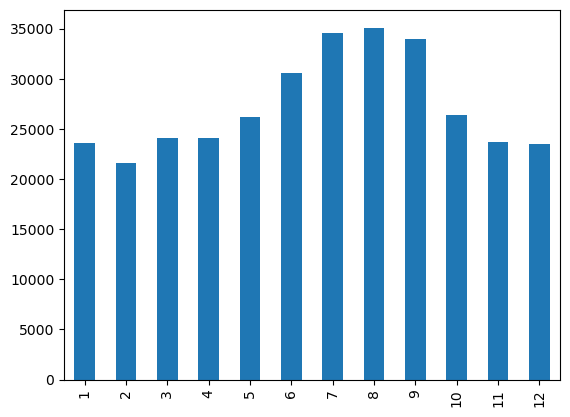
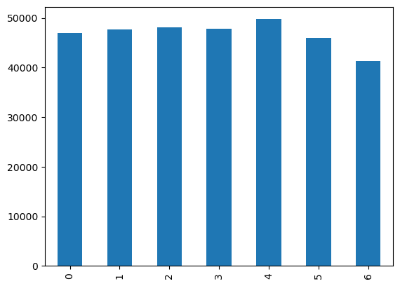
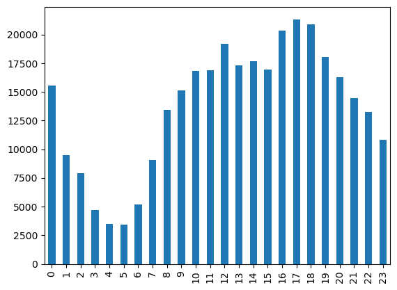
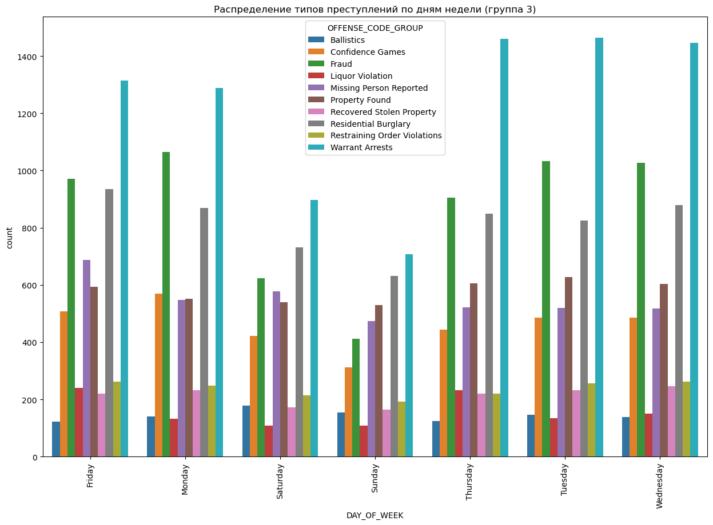
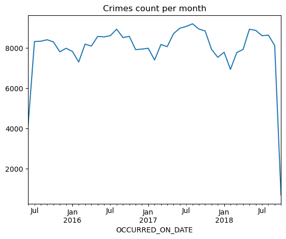
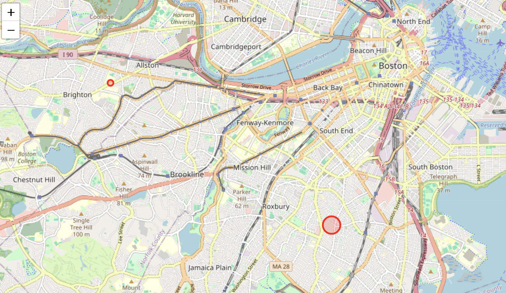

# Анализ данных о преступности в Бостоне

Набор данных, используемый в этом анализе, содержит данные о преступлениях, представленные Департаментом полиции Бостона. Данные загружены с Kaggle и предоставляют всесторонний обзор различных типов преступлений, произошедших в Бостоне.

## Автор

[_AnkurJain_](https://www.kaggle.com/ankkur13)

## Описание набора данных


Набор данных включает такие переменные, как:

- INCIDENT_NUMBER: Уникальный идентификатор для каждого инцидента с преступлением.

- OFFENSE_CODE_GROUP: Категория преступления или характер правонарушения.

- OFFENSE_DESCRIPTION: Подробное описание преступления.

- DISTRICT: Полицейский округ, в котором было зарегистрировано преступление.

- REPORTING_AREA: Конкретная область в пределах района, где было зарегистрировано преступление.

- SHOOTING: Указывает, была ли стрельба связана с преступлением.

- OCCURRED_ON_DATE: Дата и время, когда произошло преступление.

- YEAR, MONTH, DAY_OF_WEEK, HOUR: Извлеченные временные данные из даты происшествия.

- UCR_PART: Единая классификация сообщений о преступлениях _(Часть первая, часть вторая, часть третья)_.

- STREET: Улица, на которой произошел преступный инцидент.

- Lat: Координата широты, где произошел криминальный инцидент.

- Long: Координата долготы, где произошел криминальный инцидент.


## Обзор анализа


### Начальная настройка

- Были установлены необходимые библиотеки, включая pandas, seaborn, matplotlib, scipy, folium, wordcloud, nltk, gensim, torch и transformers.

- Для загрузки набора данных были настроены переменные окружения для учетных данных Kaggle API.


### Загрузка и очистка данных

- Набор данных был загружен в датафрейм pandas и проверен на предмет его структуры и сводной статистики.

- Были устранены пропущенные значения, и были созданы новые столбцы для анализа на основе времени путем извлечения года, месяца, дня недели и часа из значения OCCURRED_ON_DATE.


### Описательный анализ
- Описательные статистики _(меры центральных тенденций)_ в разрезе типа преступления и дня, в которое оно было совершено
    Данные статистики были сохранены в два файла: `grouped_describe_categorical.xlsx` и `grouped_describe_numerical.xlsx` - категориальные и числовые переменные соотвественно.
- Распределение преступности по районам и типам преступлений было визуализировано с помощью линейчатых графиков.
    - 
        На графике распределения преступлений по району видно, что в районе B2 совершено наибольшее количество преступлений _(более 50000)_. Похожая ситуация в районах C11 и D4, а в районе А15 наименьшее количество престплений _(меньше 7000)_
    - 
        На графике распределения преступлений по категории преступления _(топ 10)_ больше всего происходит аварий _(свыше 35000)_. Следующая по чистоте встречаемости, но сильно ниже - это кражи _(свыше 25000)_. А наименьшее количество _(среди топ 10)_, но все равно большое связано со случиями эвакуации _(около 13000)_.


- Был проведен временной анализ, чтобы визуализировать тенденции в количестве преступлений в разные годы, месяцы, дни недели и часы суток.
    - 
        На графике распределения престулений по годам видно, что
        наибольшее количество преступлений было совершено в 2017 году _(100.000)_. Почти столько же в 2016 году _(чуть меньше 100.000)_
    
    - 
        На графике распределения престулений по месяцам видно, что летом преступлений больше, чем зимой _(почти на 10.000)_

    - 
        На графике распределения престулений по дням недели видно, что в выходные количество преступлений меньше _(в воскресенье меньше почти на 5.000, чем в пике)_

    - 
        На графике распределения престулений по часам видно, в середине дня и вечером максимальные пики преступлений, а утром _(в 4-5 утра преступлений меньше почти на 75%)_

    - Есть типы преступлений, у которых прослеживается зависимость от дня недели, но в основном преступления распределены одинаково. 
        Пример: 
            - 
                Задержания по ордеру сильно реше происходят в выходные, но в пике в середине недели.
    - 
        По временному ряду преступлений наблюдается сезонность - видно, что к январю _(к зиме)_ количество преступлений падает, а к июлю _(к лету)_ количество преступлений возрастает, видна явная цикличность.

### Статистический анализ

- Тесты Хи-квадрат и V-статистика Крамера использовались для понимания корреляций между категориальными переменными, такими как типы преступлений и районы.

    Функция для подсчета статистики:
    ```py
    def correlation_of_crosstab(crosstab) -> float:
        chi2, p, dof, expected = chi2_contingency(crosstab)
        return np.sqrt(chi2 / (df.shape[0] * (min(crosstab.shape) - 1)))
    ```
    Вывод: 
    ```
    Kramer's correlation between OFFENSE_CODE_GROUP and DISTRICT: 0.10477894832390713
    Kramer's correlation between OFFENSE_CODE_GROUP and DAY_OF_WEEK: 0.047556720970755764
    Kramer's correlation between DISTRICT and DAY_OF_WEEK: 0.01492899178084408
    ```

    Как видим корреляция между этими группами маленькая, однако тип преступления и район, в котором оно произошло как-то коррелируют, а район и день недели, _(в которых произошло преступление)_ коррелирует даже больше, чем тип преступления и день недели

### Анализ текста


- Было сгенерировано облако слов, чтобы выявить распространенные слова, найденные в описании ASSAULT.

    - 
        Как видно часто встречаются слова **INJURED**, **PROPERTY DAMAGE**, что говорит о том, что часто бывают пострадавшие и часто наносится ущерб собственности и т.д.

- Для основных категорий преступлений было применено текстовое обобщение с использованием transformers _(в данном случае это были открытые модели Bart)_, чтобы лучше понять контекст.
    ```py
    !pip install scikit-learn
    from sklearn.feature_extraction.text import CountVectorizer
    from transformers import pipeline

    top_categories = df['OFFENSE_CODE_GROUP'].value_counts().index[:5]

    # Инициализируем суммирование
    summarizer = pipeline('summarization')

    # Инициализируем подсчет слов
    vec = CountVectorizer(stop_words='english').fit([' '.join(df['OFFENSE_DESCRIPTION'])])
    bag_of_words = vec.transform([' '.join(df['OFFENSE_DESCRIPTION'])])
    sum_words = bag_of_words.sum(axis=0) 

    words_freq = [(word, sum_words[0, idx]) for word, idx in vec.vocabulary_.items()]
    words_freq = sorted(words_freq, key = lambda x: x[1], reverse=True)

    summaries = {}
    for category in top_categories:
        descs = df[df['OFFENSE_CODE_GROUP'] == category]['OFFENSE_DESCRIPTION'].unique()
        summarised = [summarizer(desc, max_length=15, min_length=5, do_sample=False)[0]['summary_text'] for desc in descs]
        summaries[category] = sorted([(word, freq) for word, freq in words_freq if word in ' '.join(summarised)], key=lambda x: x[1], reverse=True)[:10]

    summaries
    ```
    Вывод: 
    ```py
    {
        "Motor Vehicle Accident Response": [("accident", 20087)],
        "Larceny": [("building", 10601), ("200", 20), ("50", 19), ("199", 6)],
        "Medical Assistance": [
            ("ma", 2872),
            ("death", 2625),
            ("car", 1702),
            ("attempt", 1225),
            ("suicide", 784),
            ("control", 376),
        ],
        "Investigate Person": [("ma", 2872), ("death", 2625), ("car", 1702)],
        "Other": [
            ("investigate", 30623),
            ("assault", 24476),
            ("harassment", 4263),
            ("law", 3224),
            ("ma", 2872),
            ("investigation", 1425),
            ("animal", 731),
            ("offense", 661),
            ("agency", 203),
            ("involved", 58),
        ],
    }
    ```
    Исходя из данных, вот общий контекст для каждой из категорий преступлений на основе топовых слов в суммаризации:

    1. Motor Vehicle Accident Response: Основной контекст - "аварии" (слово "accident" встретилось 20,087 раз), что вполне ожидаемо для этой категории.

    2. Larceny (кража): Здесь топовые слова - это "200" и "50". Эти числа могут быть связаны с частотой упоминания в контексте кражи. Число "199" также присутствует, возможно, это коды законодательства или какие-то оперативные термины, связанные с этим типом преступлений.

    3. Medical Assistance (медицинская помощь): Этот контекст включает такие слова, как "ma" (Массачусетс?), "death" (смерть), "car" (автомобиль), "attempt" (попытка), "suicide" (самоубийство) и "control" (контроль). Эти ключевые слова предполагают, что в случаях, когда требуется медицинская помощь, часто упоминаются попытки самоубийства и аварии.

    4. Investigate Person (расследование лица): В эту категорию входят слова "ma", "death" и "car". Возможно, расследования лиц часто связаны со смертельными случаями и авариями.

    5. Other ( другое ): В этой категории наиболее частыми являются слова "investigate" (расследовать), "harassment" (домогательства), "law" (закон), "ma", "viol" (возможно, сокращение от violation - нарушение), "investigation" (расследование), "animal" (животное), "offense" (преступление), "agency" (агентство) и "involved" (участвует). Это показывает относительно большое разнообразие кейсов в этой категории.


### Геопространственный анализ

- Алгоритм кластеризации DBSCAN был использован для определения горячих точек преступности на карте с помощью folium.

    ```py
    from sklearn.preprocessing import MinMaxScaler

    # гео анализ, группируем точки перступлений, с помощью кластеризации DBSCAN

    df_sample = df.dropna(subset=['Lat', 'Long']).sample(500)

    from sklearn.cluster import DBSCAN

    # достаем кокординаты
    coords = coords = df_sample[['Lat', 'Long']].values

    # пространственная кластеризация
    kms_per_radian = 6371.0088
    epsilon = 1 / kms_per_radian
    db = DBSCAN(eps=epsilon, min_samples=5, algorithm='ball_tree', metric='haversine').fit(np.radians(coords))

    df_sample['Cluster'] = db.labels_

    # количество кластеров (игнорируем шумные кластеры)
    num_clusters = len(set(db.labels_)) - (1 if -1 in db.labels_ else 0)

    print('Number of clusters: {}'.format(num_clusters))
    cluster_centers = df_sample.groupby('Cluster')[['Lat', 'Long']].mean().values

    # считаем размер кластера
    cluster_sizes = df_sample.groupby('Cluster').size().values.reshape(-1, 1)

    # нормализуем размеры кластеров
    scaler = MinMaxScaler(feature_range=(5, 15)) # range of marker sizes to scale to
    normalized_sizes = scaler.fit_transform(cluster_sizes)

    # создаем карту
    lat, lon = df_sample.Lat.mean(), df_sample.Long.mean()
    crime_map = folium.Map(location=[lat, lon], zoom_start=13)

    # добавляем макеры на каждый кластер
    for i in range(len(cluster_centers)):
        # ignore noise clusters
        if i != -1:
            folium.CircleMarker((cluster_centers[i][0], cluster_centers[i][1]), radius=normalized_sizes[i][0], color='red', fill=True).add_to(crime_map)

    crime_map
    ```
    
    На юге Бостона чаще всего кластеризуются преступления _(не менее 5 преступлений в радиусе 1 км)_


### Резюме

В целом, анализ позволил получить представление о распределении видов преступлений по разным округам, временных закономерностях, связанных с преступлениями, выявил очаги преступной деятельности в Бостоне.

Геопространственная кластеризация выявила ключевые области, где преступления более сконцентрированы.

Использование статистических методов сделало этот проект показательным по динамике преступности в Бостоне.


